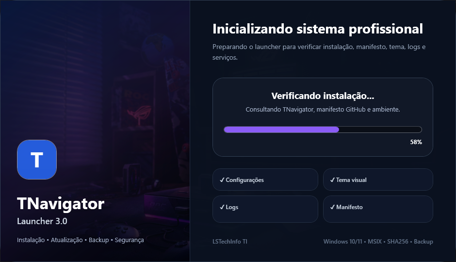
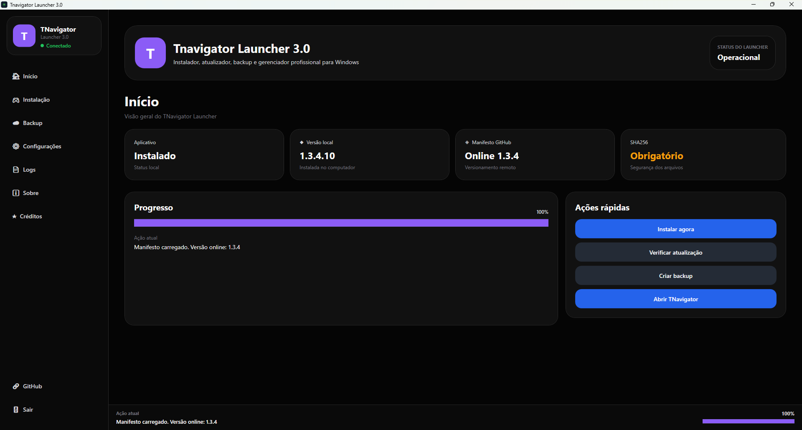
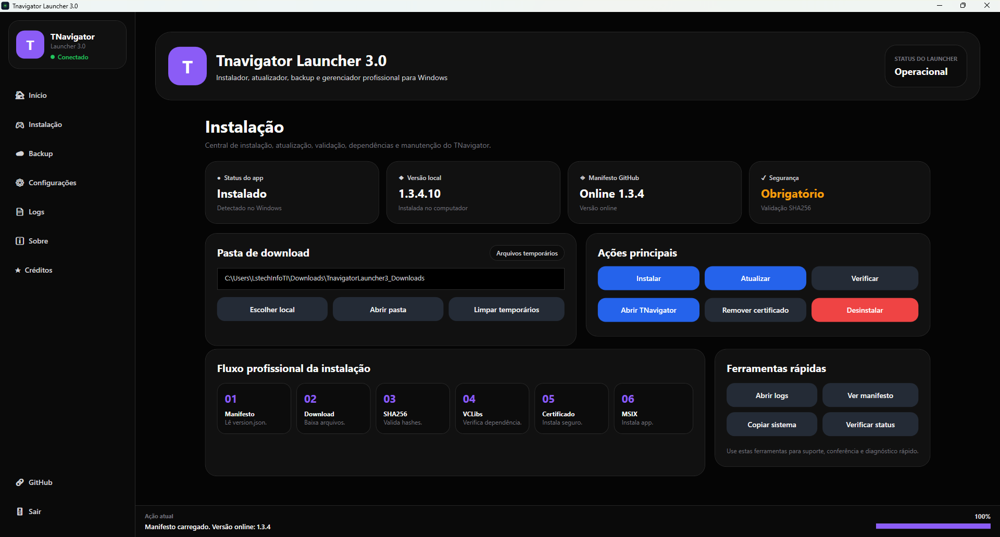
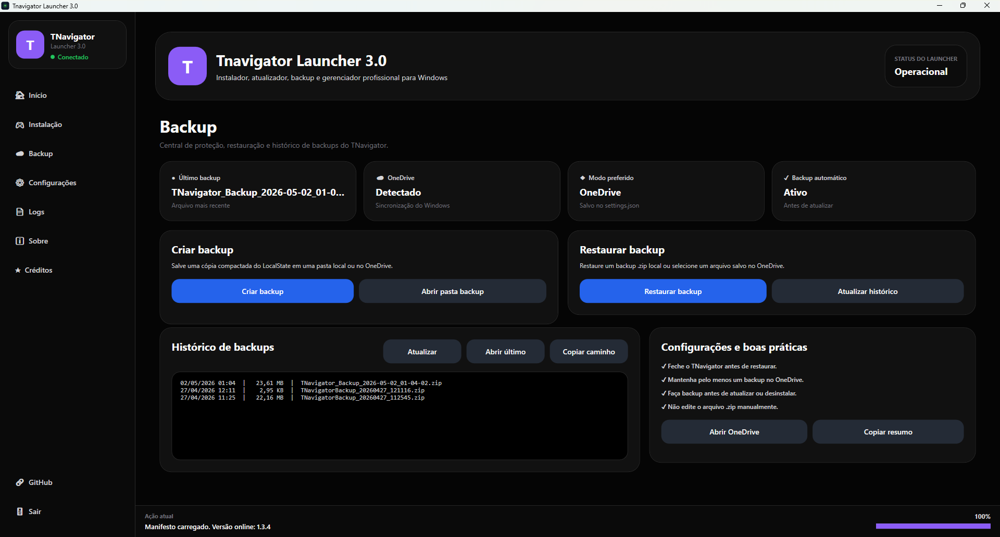
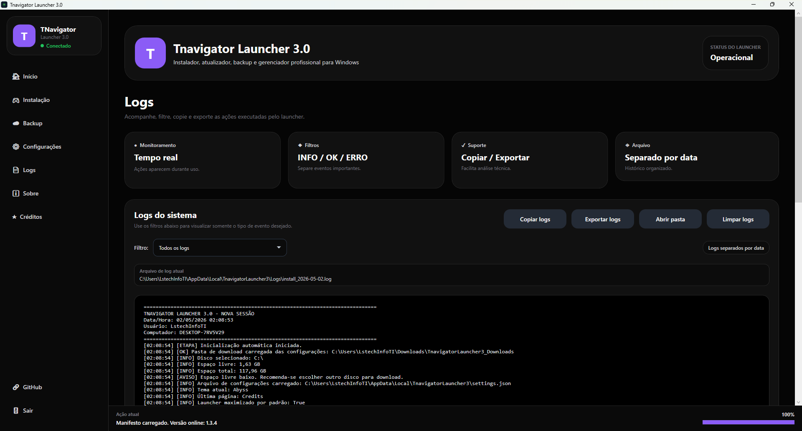
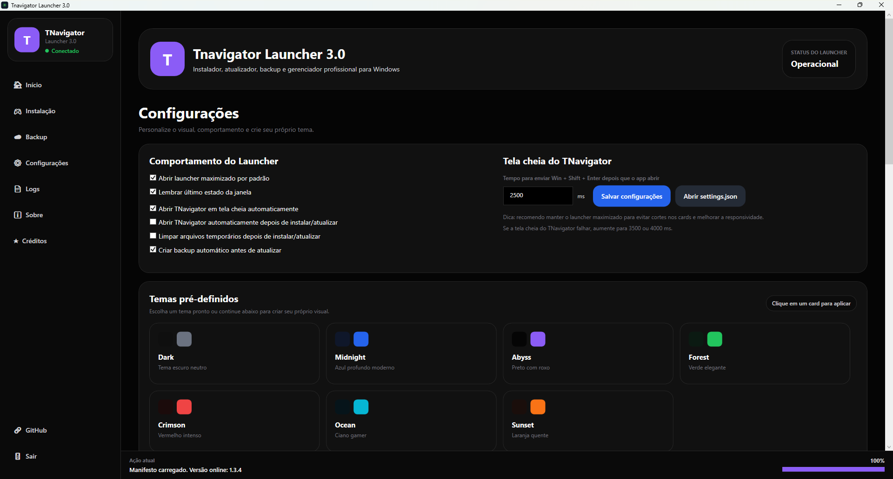
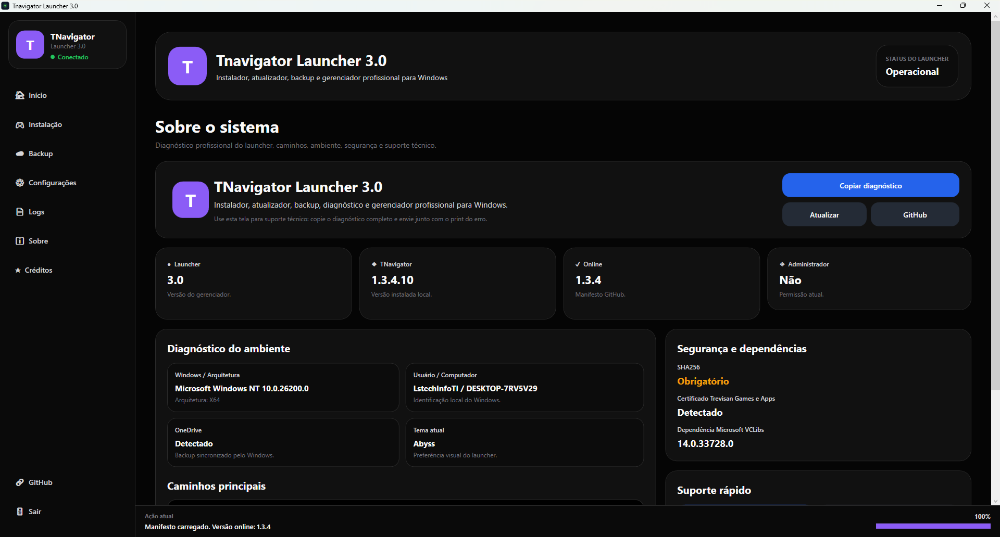
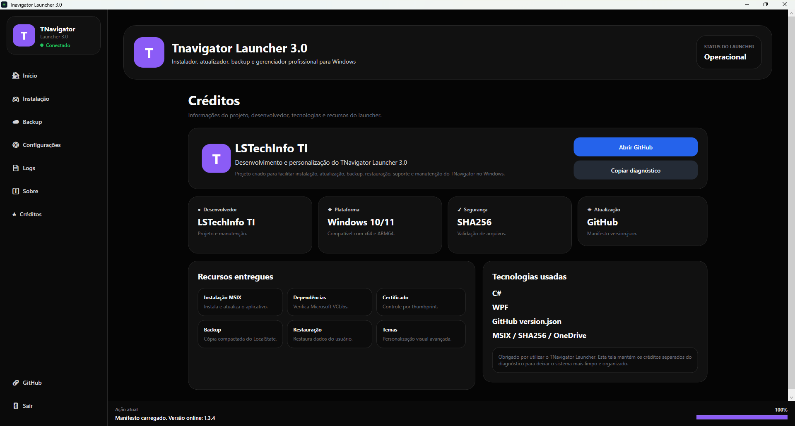

<p align="center">
  
</p>

<h1 align="center">TNavigator Launcher</h1>

<p align="center">
  <strong>Página oficial de download do TNavigator Launcher 3.0.0 para Windows 10/11.</strong>
</p>

<p align="center">
  <a href="https://github.com/lstechinfoti/TNavigator-Launcher/releases/latest">
    
  </a>
</p>

<p align="center">
  
  
  
  
</p>

---

## Download

Baixe a versão mais recente pela página oficial de Releases:

### [⬇️ Baixar TNavigator Launcher](https://github.com/lstechinfoti/TNavigator-Launcher/releases/latest)

Link direto do instalador:

```text
https://github.com/lstechinfoti/TNavigator-Launcher/releases/latest/download/TNavigatorLauncher_Setup_3.0.0.exe
```

Arquivo da versão atual:

```text
TNavigatorLauncher_Setup_3.0.0.exe
```

---

## Sobre o TNavigator Launcher

O **TNavigator Launcher** é um instalador, atualizador, gerenciador de backup, restauração, logs e diagnóstico para o TNavigator no Windows.

Este repositório funciona como a página oficial de distribuição, documentação e download do launcher.  
O código-fonte não é publicado neste repositório.

---

## Recursos principais

| Recurso | Descrição |
|---|---|
| Instalação | Instala o TNavigator pelo launcher |
| Atualização | Consulta versão online via GitHub/version.json |
| SHA256 | Validação obrigatória dos arquivos baixados |
| VCLibs | Verificação/instalação da dependência Microsoft VCLibs |
| Certificado | Instalação e remoção controlada do certificado |
| Backup | Backup local e OneDrive |
| Restauração | Restauração de backup `.zip` |
| Logs | Logs com filtros, exportação e cópia |
| Diagnóstico | Tela Sobre com diagnóstico técnico completo |
| Interface | Visual moderno, temas e abertura maximizada |

---

## Visual do sistema

### Splash screen

<p align="center">
  
</p>

### Telas principais

| Home | Instalação |
|---|---|
|  |  |

| Backup | Logs |
|---|---|
|  |  |

| Configurações | Sobre |
|---|---|
|  |  |

| Créditos |
|---|
|  |

---

## Requisitos

| Requisito | Detalhe |
|---|---|
| Sistema | Windows 10 ou Windows 11 |
| Arquitetura | x64 recomendado |
| Permissão | Administrador para certificado e operações protegidas |
| Internet | Necessária para download/atualização |
| Distribuição | GitHub Releases |

---

## Como instalar

1. Acesse a página de **Releases**.
2. Baixe o arquivo `TNavigatorLauncher_Setup_3.0.0.exe`.
3. Execute o instalador.
4. Siga as instruções na tela.
5. Abra o **TNavigator Launcher** pelo atalho da Área de Trabalho ou Menu Iniciar.

Guia completo: [INSTALL.md](INSTALL.md)

---

## Verificação SHA256

Cada release acompanha um arquivo `SHA256.txt`.

Hash da versão atual:

```text
3F2B30DE919D3FB1382C102C8CBBB6C7163D6143E55E9D9FC0AA73A5CC35D0E2
```

Para verificar no PowerShell:

```powershell
Get-FileHash .\TNavigatorLauncher_Setup_3.0.0.exe -Algorithm SHA256
```

Compare o resultado com o conteúdo do arquivo `SHA256.txt` anexado na release.

---

## version.json

Este repositório também possui um `version.json` para consulta de versão online:

```text
https://raw.githubusercontent.com/lstechinfoti/TNavigator-Launcher/main/version.json
```

---

## Segurança

Baixe o instalador somente pela página oficial de Releases:

```text
https://github.com/lstechinfoti/TNavigator-Launcher/releases/latest
```

Leia também:

- [SECURITY.md](SECURITY.md)
- [SUPPORT.md](SUPPORT.md)

---

## Suporte

Para suporte técnico, abra o launcher e use a tela **Sobre** para copiar o diagnóstico.

Ao solicitar suporte, envie:

- Print do erro.
- Log exportado.
- Diagnóstico copiado.
- Versão do Windows.
- Versão do launcher.

---

## Créditos

Desenvolvido e mantido por **LSTechInfo TI**.

---

<p align="center">
  <strong>TNavigator Launcher 3.0.0</strong><br>
  Windows 10/11 • GitHub Releases • SHA256 • Backup • Diagnóstico
</p>
